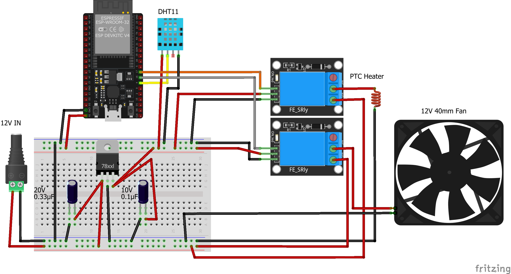

A simple drybox proof of concept made for my mechatronics class.
It uses an esp32 and controls a fan and a ptc heater with a relay.
The user can control the device by connecting to the esp32's wifi and accessing a web interface at [drybox.local](http://drybox.local) or by using the provided api.

# Features
- A simple and easy to use web interface build using [beerccs](https://www.beercss.com/)
- Usage of SPIFFS to store the web interface files
- An api that can be used to control the device from other applications
- MDNS support so the device can be accessed at drybox.local

# API
There's also a simple api provided at drybox.local/api that can be used to control the device:

- `/api/status` : Returns the current status of the device
- `/api/heater?enabled=true` :  Turns the heater on/off
- `/api/fan?enabled=false` : Turns the fan on/off
- `/api/auto?enabled=true` : Turns the auto mode on/off. When auto mode is on the system will try to maintain the humidity and temperature at the levels set by the user. When this mode is on the system will control the heater and the fan to maintain the levels set by the user.
- `/api/setHumRange?min=30&max=40` : Sets the humidity range the system will try to maintain
- `/api/setTempRange?min=30&max=40` : Sets the temperature range the system will try to maintain
- `/api/reboot` : Reboots the device

# Circuit

